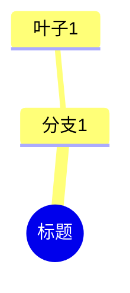

# Obsidian Export Template

This file documents the Obsidian export template structure used by `export_obsidian`.

## Output Format

Each exported note follows this structure:

```markdown
---
title: "视频标题"
source_url: "https://..."
platform: "bilibili"
video_id: "BV1xxx"
task_id: "abc123"
created_at: "2026-05-09T10:00:00+00:00"
exported_at: "2026-05-09T10:05:00+00:00"
tags:
  - "Python"
  - "机器学习"
---

# 视频标题

## 核心概览
概览内容...

## 关键要点
- 要点1
- 要点2

## 章节时间线
- `00:00` **章节1**: 摘要
- `05:30` **章节2**: 摘要

## 知识笔记
笔记正文...

## 思维导图

```

## File Naming

Files are named using the pattern: `{title} {YYYY-MM-DD}.md`

If a file with the same name exists, a counter is appended: `{title} {YYYY-MM-DD} (2).md`

## Frontmatter Fields

| Field | Type | Description |
|-------|------|-------------|
| `title` | string | Video title or lecture title |
| `source_url` | string | Original video URL |
| `platform` | string | Video platform (bilibili, youtube, etc.) |
| `video_id` | string | Platform-specific video ID |
| `task_id` | string | Internal task ID |
| `created_at` | ISO 8601 | When the task was created |
| `exported_at` | ISO 8601 | When the note was exported |
| `tags` | list[string] | Video tags |
